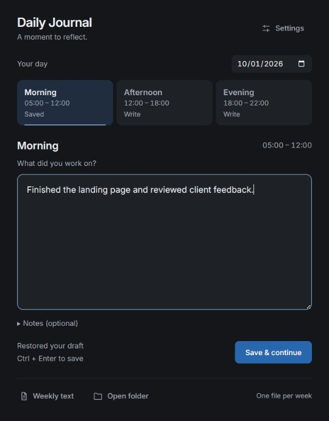
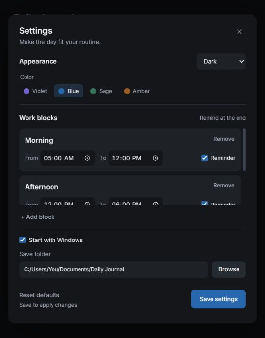

# Daily Journal

**Quick check-ins. Clearer weeks.**

Daily Journal is a minimal Windows tray app for recording what you worked on without opening a separate text editor. Write a short entry for a time block, save it, and get back to work. The app collects your saved entries into one readable text file per week.



[Download the Windows app](https://github.com/TheMIU/DailyJournal/raw/refs/heads/main/dist/DailyJournal.exe) · [How to use](#how-to-use) · [Build from source](#build-from-source)

## What it does

- Quick work entry with optional notes, saved with **Ctrl + Enter**.
- Custom blocks: add, rename, remove, and change start/end times.
- Optional reminders at the end of each block; already saved blocks are skipped.
- Weekly `.txt` files grouped by date, ready for personal reflection or AI feedback.
- Local drafts, editable saved entries, and a date picker for catching up.
- A quiet tray workflow and optional Windows startup.
- Inter typography, Light/Dark modes, and Blue, Violet, Sage, or Amber accents.
- **Reset defaults** in Settings, with journals and drafts preserved.

The default appearance is **Dark + Blue**. Existing saved preferences are kept when you upgrade.

## Get started

1. Download [DailyJournal.exe](https://github.com/TheMIU/DailyJournal/raw/refs/heads/main/dist/DailyJournal.exe), or use `dist/DailyJournal.exe` from this repository.
2. Put the executable in a folder you want to keep, then run it. Exit any older version from its tray menu before switching to this build.
3. Open **Settings** to choose your save folder, blocks, reminder times, and Windows startup preference.

This build is for **Windows x64**. The app needs the [Microsoft Edge WebView2 Runtime](https://developer.microsoft.com/en-us/microsoft-edge/webview2/). If the runtime is missing on your computer, install it before running the app.

There is one final executable: `dist/DailyJournal.exe`. No installer, account, or Node.js installation is needed to use it.

## How to use

### Record your work

1. Choose the date and block.
2. Type what you did during that time period. A sentence or a short list is enough.
3. Expand **Notes** only if there is something worth remembering.
4. Press **Ctrl + Enter** or choose **Save & continue**.

The entry is saved directly, the weekly text file updates, and the window returns to the tray.

Unsubmitted text stays in local draft storage for each date, block, and save folder. Drafts are **not** included in your weekly file until you save them.

### Edit or catch up

Choose a saved block to edit it. Saving replaces that date/block entry while keeping the rest of the week. Use the date picker to fill in a previous day.

Entries keep the block name and time period they had when last saved. Changing your schedule does not rewrite past entries; editing and saving an old entry records the current block settings.

### Reminders and the tray

Closing the window keeps the app running in the system tray. Click the tray icon to reopen it, or right-click for **Write Current Block**, **Open Journal Folder**, and **Exit**.

Reminders arrive at enabled block end times while Windows and the app are running. They play a short sound and open the entry window. A block already saved for that day does not remind you again. Reminders missed while the app is stopped or the computer is off/asleep are not replayed.

## Settings



| Setting | Behavior |
| --- | --- |
| Appearance | Preview Light/Dark mode and one of four color presets. |
| Work blocks | Add, remove, or rename blocks; change their periods and reminder toggles. Overnight periods are supported. |
| Start with Windows | Launch silently in the tray when you sign in. Enabled by default. |
| Save folder | Choose where the weekly text and editable data files are stored. |
| Reset defaults | Restore Dark + Blue, Morning/Afternoon/Evening blocks, and the default startup preference. Keep the current save folder, journal files, drafts, and reminder history. |

Settings changes, including a reset, are staged until you choose **Save settings**. Closing Settings without saving discards them and restores the previous appearance.

The default blocks are Morning **05:00–12:00**, Afternoon **12:00–18:00**, and Evening **18:00–22:00**. Reminder times are each block's end time.

## Weekly files and reflection

Files are named for the Monday of their week:

```text
Daily Journal/
  week-2026-09-28.txt
  week-2026-09-28.json
```

The `.txt` file is for reading and sharing. The companion `.json` file stores the editable entries. **Keep both files together**, and edit your journal through the app: the text file is generated from the JSON data.

Example text output:

```text
Weekly work journal: 2026-09-28 to 2026-10-04

Date - 2026-10-01

Morning (05:00 - 12:00)
Work - Finished the landing page and reviewed client feedback.
Notes - Best focus before checking messages.

Afternoon (12:00 - 18:00)
Work - Fixed two bugs and planned tomorrow.
```

Only saved entries appear, ordered by date and block start time. Empty optional notes are omitted. Choose **Weekly text** to open the selected date's week, or **Open folder** to find files for sharing.

A useful prompt for an AI agent:

> Review my work journal. Identify patterns in progress and interruptions, suggest three practical improvements, and help me choose priorities for next week. Distinguish evidence from assumptions.

## Local storage

- Journals: your chosen folder; by default `%USERPROFILE%\Documents\Daily Journal`.
- Settings: `%APPDATA%\DailyJournal\config.json`.
- Drafts: local WebView storage on this computer.

The app works offline, with Inter bundled locally. It does not upload your journal or send entries to an AI. You choose when to share a weekly text file.

Older reminder schedules migrate to editable blocks. Existing Markdown journal files stay in their folder; they are not automatically imported into weekly files.

## Build from source

Required:

- [Rust](https://rustup.rs/) with the `x86_64-pc-windows-msvc` toolchain.
- [Microsoft C++ Build Tools](https://visualstudio.microsoft.com/visual-cpp-build-tools/) with the Desktop development with C++ workload and a Windows SDK.
- Microsoft Edge WebView2 Runtime to run the app.

Run:

```bat
build_windows.bat
```

The script builds the locked dependencies in release mode and copies the standalone executable to `dist/DailyJournal.exe`. Exit the running app before replacing that file. It uses the workspace `target` directory unless `CARGO_TARGET_DIR` is already set.

Or compile manually:

```powershell
cargo build --release --locked
```

The executable is `target/release/daily_journal.exe` when using the default Cargo target directory.

### Checks

```powershell
cargo test --lib --locked
node tests/frontend.cjs
```

The Rust tests cover weekly grouping, replacement of entries, settings migration, and validation. The dependency-free frontend checks cover draft recovery, failed saves, appearance preview/save/cancel, and a reset that preserves the folder and journal data. Node.js is needed only to run the frontend checks.

## Project structure

```text
src/              Rust backend: settings, journal storage, reminders, tray, startup
ui/               App HTML, CSS, JavaScript, and bundled Inter font
capabilities/     Tauri permissions for receiving reminder events
icons/            Application and tray icons
dist/             The final DailyJournal.exe build
docs/             Static project webpage, screenshots, and font assets
tests/            Frontend behavior checks
build_windows.bat Windows release build script
```

Built with Tauri v2, Rust, and plain HTML/CSS/JavaScript.

## Project webpage

The `docs/` folder contains a static webpage explaining what the app does and how to use it. It needs no package installation or build step. Open `docs/index.html` locally, or preview it with:

```powershell
python -m http.server 8000 --directory docs
```

Then visit `http://localhost:8000`.

After pushing this repository to GitHub, publish the page from **Settings → Pages → Deploy from a branch**, selecting **main** and **/docs**. See [GitHub's publishing-source guide](https://docs.github.com/en/pages/getting-started-with-github-pages/configuring-a-publishing-source-for-your-github-pages-site). Download links point to `dist/DailyJournal.exe` on `main`, so include the final executable when pushing. The webpage is prepared locally; publishing it is a separate step.

For a tagged GitHub release, attach `dist/DailyJournal.exe` as the Windows download.

## Third-party notices

Inter is by Rasmus Andersson and is distributed under the SIL Open Font License 1.1. Its license is included in `ui/fonts/OFL.txt` and `docs/assets/OFL.txt`. Rust dependencies retain their respective licenses.
